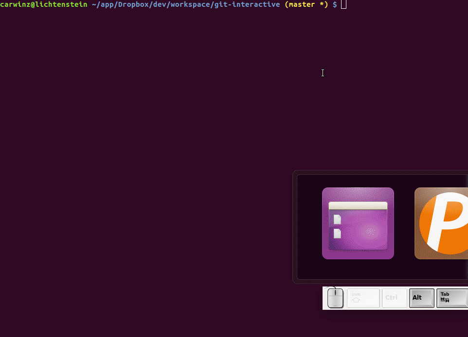

Make the __git status__ command interactive.

Instead of running 'git status' and then running another command for each file (e.g. git add somedir/somefile), this removes the need for typing follow-up commands. Instead you can hit a single key to stage a file, checkout a file, etc.

Simply use the arrow keys to go the appropriate line and press one of the following:

* a - to add/stage
* c - to checkout/revert a file
* d - to delete a file
* i - to add to the ignore file
* u - to unstage the file

## Building

    ./scripts/bundle

## Installation

    Download latest binary ('git-interactive') from https://github.com/carwinz/git-interactive/releases and place it on your path.

Then run:

    git interactive

## Running locally

    ./scripts/bundle && dist/git-interactive

## Roadmap

* Stage individual chunks
* Show which commits are committed and ready to push
* Make git log easier
* Show side by side diff. Something like: https://github.com/ymattw/cdiff
* Background check remote for changes and notify. http://stackoverflow.com/questions/2514270/how-to-check-for-changes-on-remote-origin-git-repository
